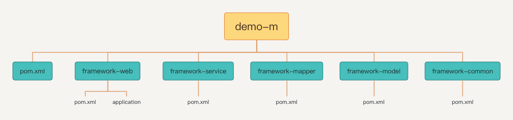
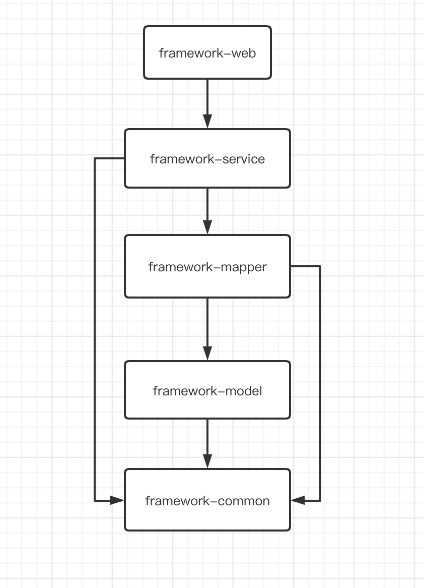

SpringBoot多模块开发demo
======   
 
项目整体结构
-----


模块依赖关系   
-----


快速开始
-----

##### 表结构
````
CREATE TABLE `user` (
  `id` int(10) NOT NULL AUTO_INCREMENT,
  `age` int(10) NOT NULL DEFAULT '0',
  `username` varchar(32) NOT NULL,
  `password` varchar(50) NOT NULL,
  `address` varchar(32) NOT NULL,
  PRIMARY KEY (`id`) USING BTREE
) ENGINE=InnoDB AUTO_INCREMENT=1 DEFAULT CHARSET=utf8mb4 ROW_FORMAT=COMPACT;
````

##### 启动程序
* framework-web模块 FrameworkWebApplication

##### 访问
**http://localhost:8082/user/list**
